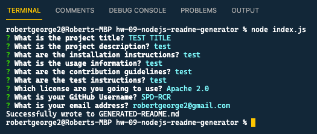
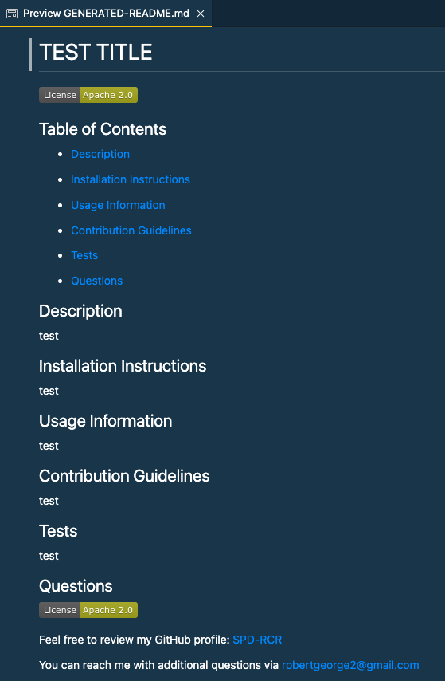

# HW-09 Node.JS: README Generator

## Table of Contents

- [Description](#Description)

- [Installation Instructions](#Installation-Instructions)

- [Usage Information](#Usage-Information)

- [Contribution Guidelines](#Contribution-Guidelines)

- [Tests](#Tests)

- [Questions](#Questions)

## Description

This "command-line" application uses Node.JS and the NPM Inquirer package to quickly and easily generate a README.md file with the input you supply about your project. -- This README file was created using this README Generator.

## Installation Instructions

You MUST first run `npm install`. After you verify `package.json` was added to your directory; you can then run `npm i inquirer`.

## Usage Information

From the command-line, type `node index.js` to invoke or start the application. Simply enter your answers to each of the questions. Followed by clicking the Enter or Return key. Use the up and down arrow keys to choose between the license selections.

_Video Demo Walk-Through_

<!--  -->

## Contribution Guidelines

To contribute to this open source application use the links provided in the Questions section below.

## Tests

Currently there are no Testing processes. Feel free to contact me if you would like to contribute to this area.

## Questions

Feel free to review my GitHub profile: [SPD-RCR](https://github.com/SPD-RCR/)

You can reach me with additional questions via [robertgeorge2@gmail.com](mailto:robertgeorge2@gmail.com)
